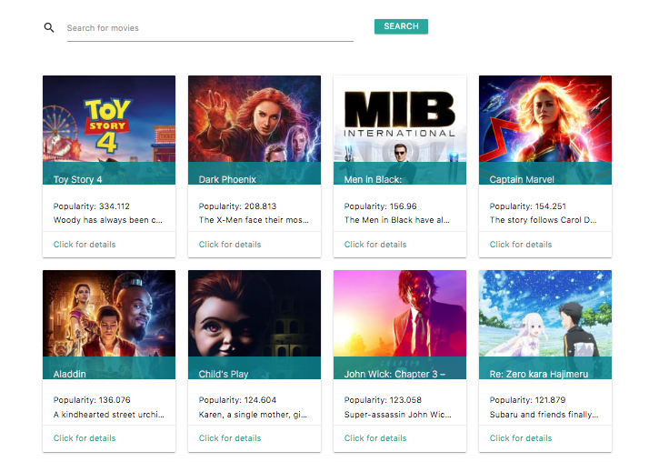
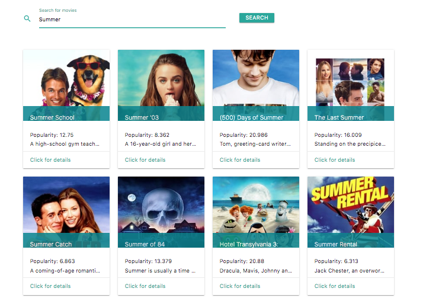
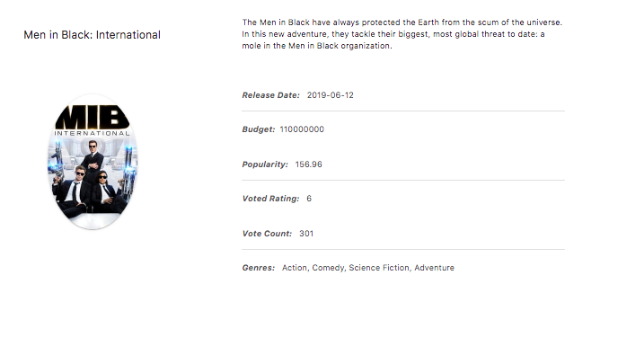

### Discover Movies

[Deployed Link](https://haldevel.github.io/discover-movies/)

* by Halina Zmachynskaya

 --------------------------------------------

#### Description
### The app is a React app that consumes the Movie Database API. The app displays a list of 20 most popular movies when first loaded. 

 

The page has a search bar to search for movies based on a title, and a list of twenty movies is provided when a user presses ```ENTER``` key or the button "search".



Each card with a movie has a link "Click for Details" to the page with the information regarding this movie, such as movie poster, release date, synopsis, budget, etc). 



 --------------------------------------------

Aside from react and react-dom, the following packages were used:
* axios
* react-router-dom
* dotenv

The calls to the external api were implemented with Axios and are located in the utils/API.js file. 

The routing was implemented itilizing react-router-dom package and using BrowserRouter object. 

To consume the Movie Database API, I had to apply for the API key, which I stored in .env file and which is not uploaded to the github for security reasons. The .env file is utilized with the help of dotenv package. 

--------------------------------------------

#### Other technologies used: 
 * Materialize 
 * HTML
 * CSS
 * javascript

--------------------------------------------
